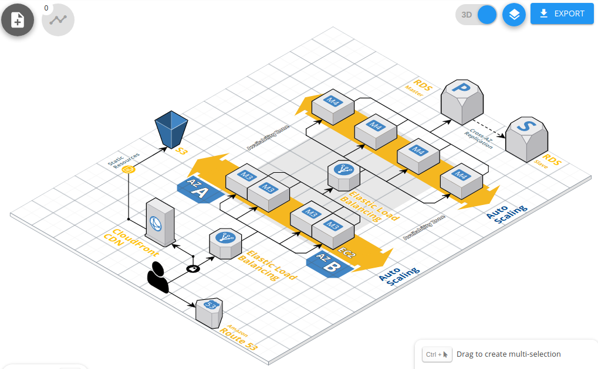

# Terraform: Infrastructure as Code 
## IaC Tools Landscape

---
# Evolution of Management IaC

- Manual(documentation?)
- Scripts
- Scripts of Scripts: 
- CMS (Configuration Management Software)
- Infrastructure as code
  - Chef (Ruby)
  - Puppet (Clojure, Ruby)
  - SaltStack (Python)
  - CFEngine (C)
  - Ansible Tower (Python)
  - Terraform (Go)
- Immutable Infrastructure

----
# Types of approaches

- **declarative** (functional): you specify the desired final state of the infrastructure you want to provision and the IaC software handles the rest
- **imperative** (procedural): helps you prepare automation scripts that provision your infrastructure

---
# Methods of Delivery

Two methods of Delivery
- **push**: the server to be configured will pull its configuration from the controlling server
- **pull**: the controlling server pushes the configuration to the destination system


---
# Tools

| Configuration management          | Infrastructure provisioning         |
|-----------------------------------|-------------------------------------|
| Ansible, Chef, Puppet, SaltStack  | Terraform, CloudFormation, Heat     |
|-----------------------------------|-------------------------------------|
| OS Configuration                  | Infrastructure Automation           |
| Application Installation          | VM and Cloud Provisioning           |
| Declarative                       | Declarative                         |
| Limited Infrastructure Automation | Limited OS Configuration Management |

---
# Tools

| Tool      | Approach                 | Delivery Method  |
|-----------|--------------------------|------------------|
| Ansible   | Declarative & Imperative | Push (and Pull)* |
| Chef      | Declarative & Imperative | Pull             |
| Puppet    | Declarative              | Pull             |
| SaltStack | Declarative & Imperative | Push and Pull    |
| Terraform | Declarative              | Push             |

- `*` there is a module [ansible-pull](https://docs.ansible.com/ansible/latest/cli/ansible-pull.html)
---
# Q/As @ Stack Exchange
| Tool                            | Result | Tag  |
|---------------------------------|--------|------|
| Terraform                       | 14,733 | 4971 |
| CloudFormation                  | 9,547  | 4557 |
| Azure Resource Templates        | 1801   | 1806 |
| Google Cloud Deployment Manager | 250    | 174  |

---
# Terraformer

A CLI tool that generates tf/json and tfstate files based on existing infrastructure (reverse Terraform)

```
$ terraformer import aws --resources=vpc,subnet
2020/05/02 20:56:49 aws importing default region
2020/05/02 20:56:49 aws importing... vpc
2020/05/02 20:56:56 Refreshing state... aws_vpc.tfer--vpc-002D-505d8d3b
2020/05/02 20:57:05 aws importing... subnet
2020/05/02 20:57:12 Refreshing state... aws_subnet.tfer--subnet-002D-d1bc47ba
2020/05/02 20:57:12 Refreshing state... aws_subnet.tfer--subnet-002D-0e487974
2020/05/02 20:57:12 Refreshing state... aws_subnet.tfer--subnet-002D-46a0390a
2020/05/02 20:57:19 aws Connecting.... 
2020/05/02 20:57:19 aws save vpc
2020/05/02 20:57:19 aws save tfstate for vpc
2020/05/02 20:57:19 aws save subnet
2020/05/02 20:57:19 aws save tfstate for subnet
```

---
# Terraformer

```
$ cat generated/aws/subnet/variables.tf 
data "terraform_remote_state" "vpc" {
  backend = "local"

  config = {
    path = "../../../generated/aws/vpc/terraform.tfstate"
  }
}
$ cat generated/aws/subnet/subnet.tf 
resource "aws_subnet" "tfer--subnet-002D-0e487974" {
  assign_ipv6_address_on_creation = "false"
  cidr_block                      = "172.31.16.0/20"
  map_public_ip_on_launch         = "true"
  vpc_id                          = "${data.terraform_remote_state.vpc.outputs.aws_vpc_tfer--vpc-002D-505d8d3b_id}"
}
```

---
# HashiCorp Suite

### Find the odd one


---
# HashiCorp Suite

- Vagrant is written in Ruby, uses extremely feature rich DSL
- All others are written in Go, uses HCL
- HCL is not a format for serializing data structures(like JSON, YAML, etc). HCL is a syntax and API for building structured configuration formats
- HCL attempts to strike a compromise between generic serialization formats such as YAML and configuration formats built around full programming languages such as Ruby


---
# Terragrunt

- Keep your Terraform code DRY(remote source)
- Keep your remote state configuration DRY(support expressions, variables and functions)
- Keep your CLI flags DRY(extra CLI arguments)
- Execute Terraform commands on multiple modules at once(run terragrunt once)
- Work with multiple AWS accounts(assume an IAM role)
- Inputs(inputs block)
- Locals
- Before and After Hooks(actions that will be called either before or after execution)
- ...

---
# bash-completion

```bash
$ bash_it enable completion terraform
```
```bash
$ wget "https://raw.githubusercontent.com/Bash-it/bash-it/\
master/completion/available/terraform.completion.bash"
$ source terraform.completion.bash
```

---
# Blast Radius

[28mm/blast-radius: Interactive visualizations of Terraform dependency graphs using d3.js](https://github.com/28mm/blast-radius)


_Blast Radius_ is a tool for reasoning about [Terraform](https://www.terraform.io/) dependency graphs with interactive visualizations.

Use _Blast Radius_ to:

* **Learn** about _Terraform_ or one of its providers through real [examples](https://28mm.github.io/blast-radius-docs/)
* **Document** your infrastructure
* **Reason** about relationships between resources and evaluate changes to them
* **Interact** with the diagram below (and many others) [in the docs](https://28mm.github.io/blast-radius-docs/)

[](https://github.com/28mm/blast-radius/blob/master/doc/blastradius-interactive.png)

---
# Cloudcraft: Overview


[Cloudcraft – Draw AWS diagrams](https://www.cloudcraft.co/)

Create a professional architecture diagram in minutes with the Cloudcraft visual designer, optimized for AWS with smart components.  
  
Whether you're starting a new project, or importing your existing AWS environment, Cloudcraft is the fastest and easiest way to iterate on your design.

---
# Cloudcraft: Terraform

```
terraform {
  source = "git::git@github.com:terraform-aws-modules/terraform-aws-rds.git?ref=v2.14.0"
}

include {
  path = find_in_parent_folders()
}

###########################################################
# View all available inputs for this module:
# https://registry.terraform.io/modules/terraform-aws-modules/rds/aws/2.14.0?tab=inputs
###########################################################
inputs = {
  # The allocated storage in gigabytes
  # type: string
  allocated_storage = "5"
```

