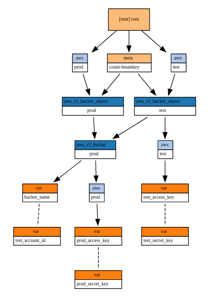

# Infrastructure Diagrams


---
# Blast Radius



[_Blast Radius_ ](https://github.com/28mm/blast-radius)is a tool for reasoning about [Terraform](https://www.terraform.io/) dependency graphs with interactive visualizations.

Use _Blast Radius_ to:

* **Learn** about _Terraform_ or one of its providers through real [examples](https://28mm.github.io/blast-radius-docs/)
* **Document** your infrastructure
* **Reason** about relationships between resources and evaluate changes to them
* **Interact** with the diagram below (and many others) [in the docs](https://28mm.github.io/blast-radius-docs/)

---
# [Cloudcraft](https://www.cloudcraft.co/)


Create a professional architecture diagram in minutes with the Cloudcraft visual designer, optimized for AWS with smart components.  
  
Whether you're starting a new project, or importing your existing AWS environment, Cloudcraft is the fastest and easiest way to iterate on your design.

---
# Cloudcraft: Terraform

```
terraform {
  source = "git::git@github.com:terraform-aws-modules/terraform-aws-rds.git?ref=v2.14.0"
}

include {
  path = find_in_parent_folders()
}

###########################################################
# View all available inputs for this module:
# https://registry.terraform.io/modules/terraform-aws-modules/rds/aws/2.14.0?tab=inputs
###########################################################
inputs = {
  # The allocated storage in gigabytes
  # type: string
  allocated_storage = "5"
```
---
## AWS Perspective

https://github.com/awslabs/aws-perspective

#### What does this AWS Solutions Implementation do?

AWS Perspective is a tool to visualize AWS Cloud workloads. Use AWS Perspective to build, customize, and share detailed architecture diagrams of your workloads based on live data from AWS.


source: [AWS Perspective](https://aws.amazon.com/solutions/implementations/aws-perspective/)

---


---
<style scoped>
  section {
    font-size: 20px;
  }
</style>
## AWS Perspective

> It's important to note that Perspective is not a traditional diagramming tool like draw.io or Visio. Perspective is intended to display resources that already exist rather than draw new ones.
> To do this, Perspective inventories resources in your accounts (Lambdas, DBs, EC2 instances, ENIs, EBS volumes etc.) and can automatically create a diagrammatic representations of that data. Perspective also discovers the relationships between resources and will automatically expose them on the diagram.
> The underlying data sits in a graph database (Amazon Neptune). This allows you to explore the relationships in the graph (diagram) on the fly visually to discover how your resources interact with one another.

source: [Visualize AWS Cloud Diagrams | Hacker News](https://news.ycombinator.com/item?id=24552779)


---
## mingrammer/diagrams

[mingrammer/diagrams: Diagram as Code for prototyping cloud system architectures](https://github.com/mingrammer/diagrams)

Diagrams lets you draw the cloud system architecture **in Python code**. It was born for **prototyping** a new system architecture design without any design tools. You can also describe or visualize the existing system architecture as well. Diagrams currently supports main major providers including: `AWS`, `Azure`, `GCP`, `Kubernetes`, `Alibaba Cloud`, `Oracle Cloud` etc... It also supports `On-Premise` nodes, `SaaS` and major `Programming` frameworks and languages.

**Diagram as Code** also allows you to **track** the architecture diagram changes in any **version control** system.


---
##  mingrammer/diagrams

Exposed Pod with 3 Replicas on Kubernetes:

```python
from diagrams import Diagram
from diagrams.k8s.clusterconfig import HPA
from diagrams.k8s.compute import Deployment, Pod, ReplicaSet
from diagrams.k8s.network import Ingress, Service

with Diagram("Exposed Pod with 3 Replicas", show=False):
    net = Ingress("domain.com") >> Service("svc")
    net >> [Pod("pod1"),
            Pod("pod2"),
            Pod("pod3")] << ReplicaSet("rs") << Deployment("dp") << HPA("hpa")

```

see also: [blushft/go-diagrams: Create beautiful system diagrams with Go](https://github.com/blushft/go-diagrams)


---
[IcePanel | Easily communicate complex systems](https://icepanel.io/)

### Sequence diagram flows

Your system doesn't live in a static world, and neither should your diagrams.

Overlay and show messages flowing through your system, drawing focus to each step, with our intelligent diagram flow builder.

### C4 Model

IcePanel uses the [C4 model](https://c4model.com) standard, providing a structured approach to easily communicate architectures, allowing you to zoom in & out of different levels of detail for your various audiences.

Your model keeps your diagram objects in sync from anywhere, creating consistent, up-to-date diagrams with minimal effort!

---
# IcePanel - Easily communicate complex systems


[IcePanel | Easily communicate complex systems](https://icepanel.io/)


## Structured system designs, built to increase your team’s understanding and trust in your docs.https://icepanel.io/media/flows.ae7c37db.mp4

---
# IsoFlow.io - Create and share network diagrams  

[Isoflow | Network diagrams](https://isoflow.io/)

## in minutes

Isoflow.io is a diagramming toolkit designed to clearly communicate your network architecture.

It's great for producing visuals to support onboarding sessions, presentations and documentation.


---
# Stackery - show any CloudFormation code as a Diagram

E.g: [Secure delivery of serverless applications | Stackery](https://www.stackery.io/registry/?repo=https://github.com/meniem/aws-three-tier/blob/master/aws-three-tier.yaml)

E.g: [lambda-refarch-webapp](https://www.stackery.io/registry/?repo=https://github.com/aws-samples/lambda-refarch-webapp/blob/master/template.yaml) # [aws-samples](https://github.com/aws-samples)/[lambda-refarch-webapp](https://github.com/aws-samples/lambda-refarch-webapp) The Web Application reference architecture is a general-purpose, event-driven, web application back-end that uses AWS Lambda, Amazon API Gateway for its business logic. It also uses Amazon DynamoDB as its database and Amazon Cognito for user management. All static content is hosted using AWS Amplify Console.

E.g.: [gatsby-starter-ghost](https://www.stackery.io/registry/?repo=https://github.com/stackery/gatsby-starter-ghost/blob/master/template.yaml) # [stackery](https://github.com/stackery)/[gatsby-starter-ghost](https://github.com/stackery/gatsby-starter-ghost) A starter template to build lightning fast websites with Ghost & Gatsby 

---
# Ilograph

* [Show HN: Ilograph – Interactive AWS Serverless Architecture Diagram](https://app.ilograph.com/demo.ilograph.Ilograph)
* [Beyond Whiteboarding: Creating Expert System Architecture Diagrams](https://blog.ilograph.com/posts/beyond-whiteboarding-creating-expert-system-architecture-diagrams/)
