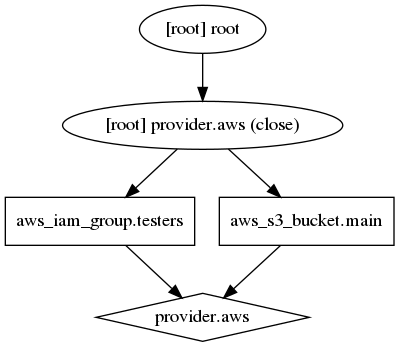
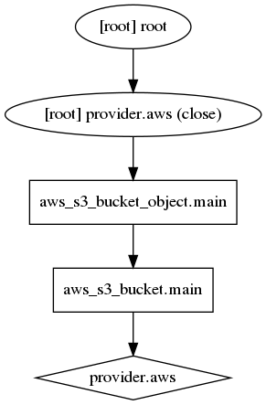
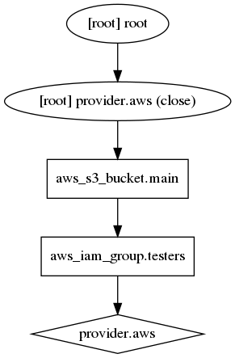

# Terraform: Infrastructure as Code 
---
# Terraform

**Resource Graph**: Terraform builds a graph of all your resources, and parallelizes the creation and modification of any non-dependent resources.

**Change Automation**: Complex changesets can be applied to your infrastructure with minimal human interaction.

Root module variables can be set in a number of ways:
- Individually, with the -var command line option.
- In variable definitions (.tfvars) files, either specified on the command line or automatically loaded.
- As environment variables.
- From console input

---
# Architecture

- Provider code is a very subtle layer for cloud or service API.
- Providers themselves are executable files that communicate with TF via gRPC.
- Each Resource implements CREATE, READ, UPDATE, and DELETE (CRUD) methods to manage itself, while Terraform Core manages a Resource Graph of all the resources declared in the configuration as well as their current state.

---
# Terraform Flow

1. Configuration Loader; Backend; State Manager
1. Create terraform.Context(main object represents all the context that Terraform needs)
1. Graph Builder
1. Graph Walker
1. Vertex Evaluation

---
# Independent Resources

```
resource "aws_iam_group" "testers" {
  name = "testers"
  path = "/users/"
}

resource "aws_s3_bucket" "main" {
  bucket = "7a4a917e-6d15-4995-8e77-addbfaba77c6"
}
```

---
# Independent Resources

```bash
$ terraform graph | grep -v meta.count-boundary | dot -Tpng > terraform_independent.png
```


---
# Implicit Dependency

```
resource "aws_s3_bucket" "main" {
  bucket = "7a4a917e-6d15-4995-8e77-addbfaba77c6"
}

resource "aws_s3_bucket_object" "main" {
  key    = "someobject"
  bucket = aws_s3_bucket.main.id
  source = "/etc/debian_version"
}
```

---
# Implicit Dependency

```bash
$ terraform graph | grep -v meta.count-boundary | dot -Tpng > terraform_implicit.png
```


---
# Explicit Dependency

```
resource "aws_iam_group" "testers" {
  name = "testers"
  path = "/users/"
}

resource "aws_s3_bucket" "main" {
  bucket     = "7a4a917e-6d15-4995-8e77-addbfaba77c6"
  depends_on = [aws_s3_bucket.main]
}
```

---
# Explicit Dependency

```bash
$ terraform graph | grep -v meta.count-boundary | dot -Tpng > terraform_explicit.png
```


