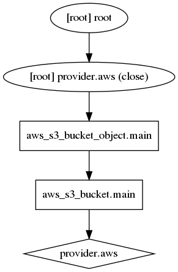

# Terraform: Infrastructure as Code 2

### Anatoly Burnashev

Senior System Engineer
DevOps Lead

---
# Agenda

- Infrastructure as code
- Terraform configuration

---
# Imperative Approach: let's prepare

## uuidgen
```
tldr uuidgen
uuidgen

Generate unique identifiers (UUIDs).

- Create a random UUID:
  uuidgen --random

- Create a UUID based on the current time:
  uuidgen --time

- Create a UUID based on the hash of a URL:
  uuidgen --sha1 --namespace @url --name object_name
```

## bucket ID:
> A bucket name is global to region and not specific to your account. So you need to choose a name that doesnt exist at all. 
e.g.: `uuidgen`

```
$ uuidgen
7a4a917e-6d15-4995-8e77-addbfaba77c6
```

---
# Imperative Approach: create

The imperative focuses on how the infrastructure is to be changed

++ AWS secrets
```bash
~~ $ aws s3api create-bucket --bucket 7a4a917e-6d15-4995-8e77-addbfaba77c6 --region us-east-2 --create-bucket-configuration LocationConstraint=us-east-2
{
    "Location": "http://7a4a917e-6d15-4995-8e77-addbfaba77c6.s3.amazonaws.com/"
}
```

```bash
$ aws s3api create-bucket --bucket 7a4a917e-6d15-4995-8e77-addbfaba77c6 --region us-east-2 --create-bucket-configuration LocationConstraint=us-east-2

An error occurred (BucketAlreadyOwnedByYou) when calling the CreateBucket operation: Your previous request to create the named bucket succeeded and you already own it.
$ echo $?
255
```

---
# Imperative Approach: show

```bash
$ aws s3api list-buckets --region us-east-2
{
    "Buckets": [
        {
            "Name": "7a4a917e-6d15-4995-8e77-addbfaba77c6",
            "CreationDate": "2020-04-30T20:05:56.000Z"
        }
    ],
    "Owner": {
        "ID": "905339dfcf0bb1be6066daadd65c3de1799387cf1d6eeb48581860f51ab59c8d"
    }
}
$ aws s3api list-buckets --region us-east-2 | jq .Buckets[0].Name
"7a4a917e-6d15-4995-8e77-addbfaba77c6"
```

---
# Imperative Approach: delete

```bash
$ aws s3api delete-bucket --bucket 7a4a917e-6d15-4995-8e77-addbfaba77c6 --region us-east-2
$ aws s3api delete-bucket --bucket 7a4a917e-6d15-4995-8e77-addbfaba77c6 --region us-east-2

An error occurred (NoSuchBucket) when calling the DeleteBucket operation: The specified bucket does not exist
$ echo $?
255
```

---
# Imperative Approach: example
```bash
output=$($AWS s3api get-bucket-versioning --bucket $dst| jq '(.Status=="Enabled")')
if [[ $output != true ]]
then
        echo "Enabling versioning for $dst"
        $AWS s3api put-bucket-versioning --bucket $dst --versioning-configuration Status=Enabled
        [[ $? -ne 0 ]] && { echo "Can't enable versioning for $dst"; exit 1; }
fi

$AWS s3api get-bucket-encryption --bucket ${dst} &>/dev/null
if [[ $? -ne 0 ]]
then
        if [[ -z ${key_arn} ]]
        then
                cmk_id=$($AWS kms create-key --origin EXTERNAL --region eu-central-1|jq '.KeyMetadata.KeyId'|tr -d \")
                [[ $? -ne 0 ]] && { echo "Can't create key"; exit 1; }
                key_arn="arn:aws:kms:eu-central-1:${id}:key/${cmk_id}"
                $AWS kms get-parameters-for-import --key-id ${cmk_id} \
                        --wrapping-algorithm RSAES_OAEP_SHA_1 \
                        --wrapping-key-spec RSA_2048 --region eu-central-1 >/tmp/get-parameters-for-import
                [[ $? -ne 0 ]] && { echo "Can't download key"; exit 1; }
                openssl enc -d -base64 -A -in PublicKey.b64 -out PublicKey.bin
```

---
# Declarative Approach

The declarative approach focuses on what the eventual target configuration should be:

```
resource "aws_s3_bucket" "main" {
  bucket = "7a4a917e-6d15-4995-8e77-addbfaba77c6"
}
```

----
# Declarative Approach: create
```bash
$ terraform apply -auto-approve
aws_s3_bucket.main: Creating...
aws_s3_bucket.main: Still creating... [10s elapsed]
aws_s3_bucket.main: Creation complete after 12s [id=7a4a917e-6d15-4995-8e77-addbfaba77c6]

Apply complete! Resources: 1 added, 0 changed, 0 destroyed.

Outputs:

arn = arn:aws:s3:::7a4a917e-6d15-4995-8e77-addbfaba77c6
$ terraform apply -auto-approve
aws_s3_bucket.main: Refreshing state... [id=7a4a917e-6d15-4995-8e77-addbfaba77c6]

Apply complete! Resources: 0 added, 0 changed, 0 destroyed.

Outputs:

arn = arn:aws:s3:::7a4a917e-6d15-4995-8e77-addbfaba77c6
```

----
# Declarative Approach: destroy

```
$ terraform destroy -auto-approve
aws_s3_bucket.main: Refreshing state... [id=7a4a917e-6d15-4995-8e77-addbfaba77c6]
aws_s3_bucket.main: Destroying... [id=7a4a917e-6d15-4995-8e77-addbfaba77c6]
aws_s3_bucket.main: Destruction complete after 1s

Destroy complete! Resources: 1 destroyed.
$ terraform destroy -auto-approve


Destroy complete! Resources: 0 destroyed.
```

----
# Local Values

A local value assigns a name to an expression, allowing it to be used multiple times within a module without repeating.

Local values can be declared together in a single locals block:
```
locals {
  company    = "epam"
  department = "devops"
}
```

---
# Data Sources

Data sources allow data to be fetched or computed for use elsewhere in Terraform configuration.

```
data "aws_vpc" "main" {
  id = "vpc-505d8d3b"
}

output "vpc_id" {
  value = data.aws_vpc.main.main_route_table_id
}
```

```
$ terraform apply:
...
Outputs:

vpc_id = rtb-928810f9
```

---
# References to Named Values

The following named values are available:

- `<RESOURCE TYPE>.<NAME>`: an object representing a managed resource
- `var.<NAME>`: the value of the input variable
- `local.<NAME>`: the value of the local value
- `module.<MODULE NAME>.<OUTPUT NAME>`: the value of the specified output value
- `data.<DATA TYPE>.<NAME>`: an object representing a data resource
- `path.module`: the filesystem path of the module where the expression is placed
- `path.root`: the filesystem path of the root module of the configuration
- `path.cwd`: the filesystem path of the current working directory
- `terraform.workspace`: the name of the currently selected workspace

---

# Lifecycle Customizations

The following lifecycle meta-arguments are supported:
- `create_before_destroy (bool)`: a new replacement object is created first, and then the prior object is destroyed only once the replacement is created
- `prevent_destroy (bool)`: will cause Terraform to reject with an error any plan that would destroy the infrastructure object
- `ignore_changes (list of attribute names)`: he given attribute names are considered when planning a create operation, but are ignored when planning an update

---
# Terraform Flow

1. Configuration Loader; Backend; State Manager
1. Create terraform.Context(main object represents all the context that Terraform needs)
1. Graph Builder
1. Graph Walker
1. Vertex Evaluation

---
# Independent Resources

```
resource "aws_iam_group" "testers" {
  name = "testers"
  path = "/users/"
}

resource "aws_s3_bucket" "main" {
  bucket = "7a4a917e-6d15-4995-8e77-addbfaba77c6"
}
```

---
# Independent Resources

```bash
$ terraform graph | grep -v meta.count-boundary | dot -Tpng > terraform_independent.png
```


---
# Implicit Dependency

```
resource "aws_s3_bucket" "main" {
  bucket = "7a4a917e-6d15-4995-8e77-addbfaba77c6"
}

resource "aws_s3_bucket_object" "main" {
  key    = "someobject"
  bucket = aws_s3_bucket.main.id
  source = "/etc/debian_version"
}
```

---
# Implicit Dependency

```bash
$ terraform graph | grep -v meta.count-boundary | dot -Tpng > terraform_implicit.png
```


---
# Explicit Dependency

```
resource "aws_iam_group" "testers" {
  name = "testers"
  path = "/users/"
}

resource "aws_s3_bucket" "main" {
  bucket     = "7a4a917e-6d15-4995-8e77-addbfaba77c6"
  depends_on = [aws_s3_bucket.main]
}
```

---
# Explicit Dependency

```bash
$ terraform graph | grep -v meta.count-boundary | dot -Tpng > terraform_explicit.png
```


---
# terraform import

The terraform import command is used to import existing resources into Terraform.

Usage: `terraform import [options] ADDRESS ID`

```
$ terraform import aws_s3_bucket.bucket new-bucket

resource "aws_s3_bucket" "bucket" {
  bucket = "new-bucket"
}
```

---
# State in AWS: bootstrap 

```
terraform {
  required_version = ">=0.12.24"
  required_providers {
    aws = ">= 2.58.0"
  }
}
provider "aws" {
  region = "eu-central-1"
}
locals {
  tags = {
    source = "terraform"
    env    = var.env
  }
}
resource "aws_s3_bucket" "backend" {
  bucket = "tf-..."
  acl    = "private"

  versioning {
    enabled = true
  }

  tags = local.tags
}
resource "aws_dynamodb_table" "backend_locks" {
  name         = "tf-..."
  billing_mode = "PAY_PER_REQUEST"
  hash_key     = "LockID"

  attribute {
    name = "LockID"
    type = "S"
  }

  tags = local.tags
}
```

---
# State in AWS

```
terraform {
  backend "s3" {
    bucket         = "tf-..."
    encrypt        = true
    key            = "tf-..."
    region         = "eu-central-1"
    dynamodb_table = "tf-..."
  }
  required_version = ">=0.12.24"
  required_providers {
    aws = ">= 2.58.0"
  }
}
provider "aws" {
  region = "eu-central-1"
  assume_role {
    role_arn = var.admin_role
  }
}
```

---
# Backends

Backends are completely optional.

Here are some of the benefits of backends:
- Working in a team
- Keeping sensitive information off disk
- Remote operations

Backend Types:
- **Standard**: State management, functionality covered in State Storage & Locking
- **Enhanced**: Everything in standard plus remote operations.

---
# Enhanced Backends

- local
- remote(Terraform Cloud)

---
# Standard Backends

- artifactory(with no locking)
- azurerm(with state locking)
- consul(with locking)
- etcd(with no locking)
- etcdv3(with locking)
- gcs(with locking)
- http(with optional locking)
- pg(with locking)
- s3(with locking via DynamoDB)
- swift(with no locking)
- terraform enterprise(with no locking)

---
# backend-config

`backend-config=path`

This can be either a path to an HCL file with key/value assignments (same format as terraform.tfvars) or a 'key=value' format. 

```bash
$ terraform init -backend-config='bucket=mycompany-tfstate' -backend-config='key=prod.tfstate'\
-backend-config='region=eu-central-1'
```

---
# S3 Remote State

```
data "terraform_remote_state" "prod" {
  backend = "s3"
  config = {
    bucket = "terraform-state-prod"
    key    = "terraform.tfstate"
    region = "eu-central-1"
  }
}
```
The terraform_remote_state data source will return all of the root module outputs defined in the referenced remote state.

---
# Modules

Modules help solve the problems:

- **Organize configuration** - Modules make it easier to navigate, understand, and update your configuration by keeping related parts of your configuration together.
- **Encapsulate configuration** - Another benefit of using modules is to encapsulate configuration into distinct logical component.
- **Re-use configuration** - Writing all of your configuration from scratch can be time consuming and error prone.
- **Provide consistency and ensure best practices** - It helps to ensure that best practices are applied across all of your configuration.

---
# Module structure

A typical file structure:
```bash
$ tree minimal-module/
.
├── LICENSE
├── README.md
├── main.tf
├── variables.tf
├── outputs.tf
```

- `LICENSE` will contain the license under which your module will be distributed.
- `README.md` will contain documentation describing how to use your module.
- `main.tf` will contain the main set of configuration for your module.
- `variables.tf` will contain the variable definitions for your module.
- `outputs.tf` will contain the output definitions for your module.

---
# Modules: nested

```
$ tree complete-module/
.
├── README.md
├── main.tf
├── variables.tf
├── outputs.tf
├── ...
├── modules/
│   ├── nestedA/
│   │   ├── README.md
│   │   ├── variables.tf
│   │   ├── main.tf
│   │   ├── outputs.tf
│   ├── nestedB/
│   ├── .../
```

---
# Modules: Local

```
module "consul" {
  source = "./consul"
}
```

---
# Modules: Registry

Registry source address: `<NAMESPACE>/<NAME>/<PROVIDER>`

```
module "consul" {
  source = "hashicorp/consul/aws"
  version = "0.1.0"
}
```

---
# Modules: GitHub

```
module "consul" {
  source = "github.com/hashicorp/example"
}
```

---
# Modules: Git

```
module "vpc" {
  source = "git::https://example.com/vpc.git"
}

module "storage" {
  source = "git::ssh://username@example.com/storage.git"
}
```

---
# terraform-aws-modules

terraform-aws-modules/terraform-aws-vpc/main.tf:
```
######
# VPC
######
resource "aws_vpc" "this" {
  count = var.create_vpc ? 1 : 0

  cidr_block                       = var.cidr
  instance_tenancy                 = var.instance_tenancy
  enable_dns_hostnames             = var.enable_dns_hostnames
  enable_dns_support               = var.enable_dns_support
  enable_classiclink               = var.enable_classiclink
  enable_classiclink_dns_support   = var.enable_classiclink_dns_support
  assign_generated_ipv6_cidr_block = var.enable_ipv6

  tags = merge(
    {
      "Name" = format("%s", var.name)
    },
    var.tags,
    var.vpc_tags,
  )
}
```

---
# terraform-aws-modules: example

Allow management of default VPC it using Terraform:

`main.tf`:
```
provider "aws" {
  region = "eu-west-1"
}

module "vpc" {
  source  = "terraform-aws-modules/vpc/aws"
  version = "2.33.0"

  create_vpc = false

  manage_default_vpc               = true
  default_vpc_name                 = "default"
  default_vpc_enable_dns_hostnames = true
}
```

---
# Registry: Modules


---
# Registry: Requirements

- GitHub. The module must be on GitHub and must be a public repo
- Named `terraform-<PROVIDER>-<NAME>`
- Repository description
- Standard module structure. The module must adhere to the standard module structure
- x.y.z tags for releases

---
# terraform: state

The terraform state command is used for advanced state management.

Usage: `terraform state <subcommand> [options] [args]`

- `terraform state list` command is used to list resources within a Terraform state
- `terraform state mv` command is used to move items in a Terraform state
- `terraform state pull` command is used to manually download and output the state from remote state
...

---
# terraform: state
- `terraform state push` command is used to manually upload a local state file to remote state
- `terraform state rm` command is used to remove items from the Terraform state
- `terraform state show` command is used to show the attributes of a single resource in the Terraform state

---
# Terraformer

A CLI tool that generates tf/json and tfstate files based on existing infrastructure (reverse Terraform)

```
$ terraformer import aws --resources=vpc,subnet
2020/05/02 20:56:49 aws importing default region
2020/05/02 20:56:49 aws importing... vpc
2020/05/02 20:56:56 Refreshing state... aws_vpc.tfer--vpc-002D-505d8d3b
2020/05/02 20:57:05 aws importing... subnet
2020/05/02 20:57:12 Refreshing state... aws_subnet.tfer--subnet-002D-d1bc47ba
2020/05/02 20:57:12 Refreshing state... aws_subnet.tfer--subnet-002D-0e487974
2020/05/02 20:57:12 Refreshing state... aws_subnet.tfer--subnet-002D-46a0390a
2020/05/02 20:57:19 aws Connecting.... 
2020/05/02 20:57:19 aws save vpc
2020/05/02 20:57:19 aws save tfstate for vpc
2020/05/02 20:57:19 aws save subnet
2020/05/02 20:57:19 aws save tfstate for subnet
```

---
# Terraformer

```
$ cat generated/aws/subnet/variables.tf 
data "terraform_remote_state" "vpc" {
  backend = "local"

  config = {
    path = "../../../generated/aws/vpc/terraform.tfstate"
  }
}
$ cat generated/aws/subnet/subnet.tf 
resource "aws_subnet" "tfer--subnet-002D-0e487974" {
  assign_ipv6_address_on_creation = "false"
  cidr_block                      = "172.31.16.0/20"
  map_public_ip_on_launch         = "true"
  vpc_id                          = "${data.terraform_remote_state.vpc.outputs.aws_vpc_tfer--vpc-002D-505d8d3b_id}"
}
```

++ Terragrunt


---
# Links

[Terraform Documentation](https://www.terraform.io/docs/)

---
# End
