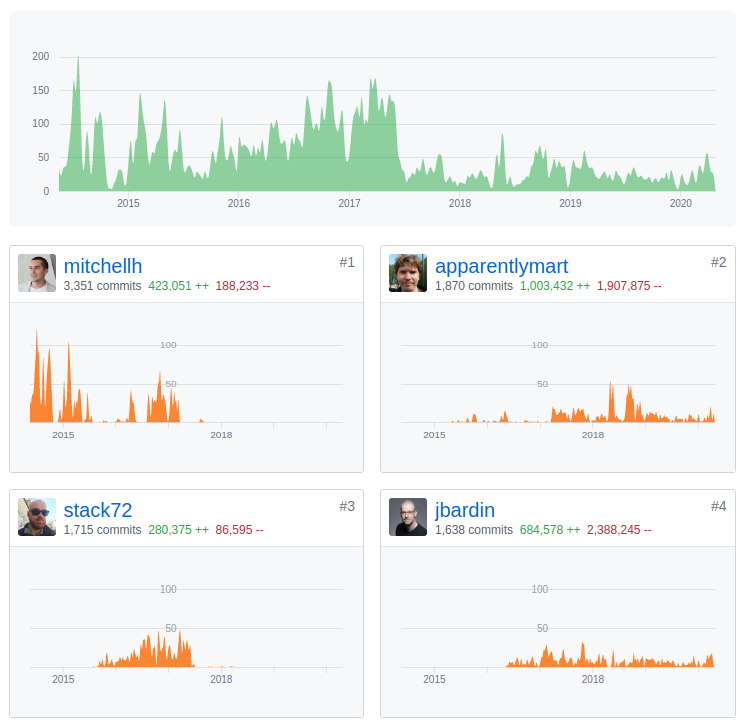
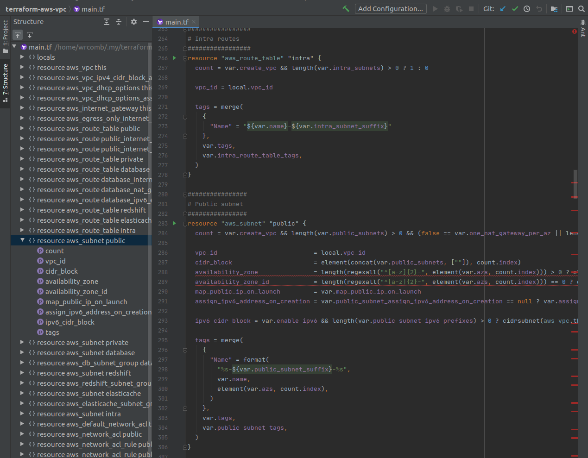
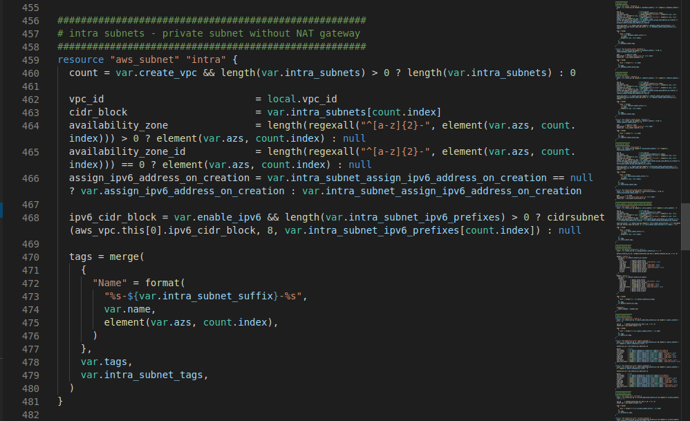
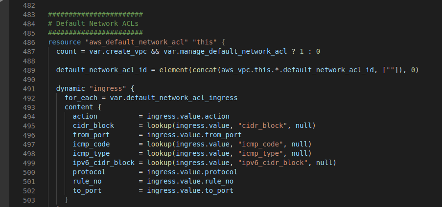
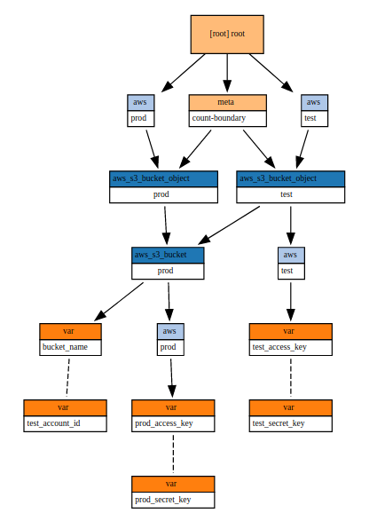
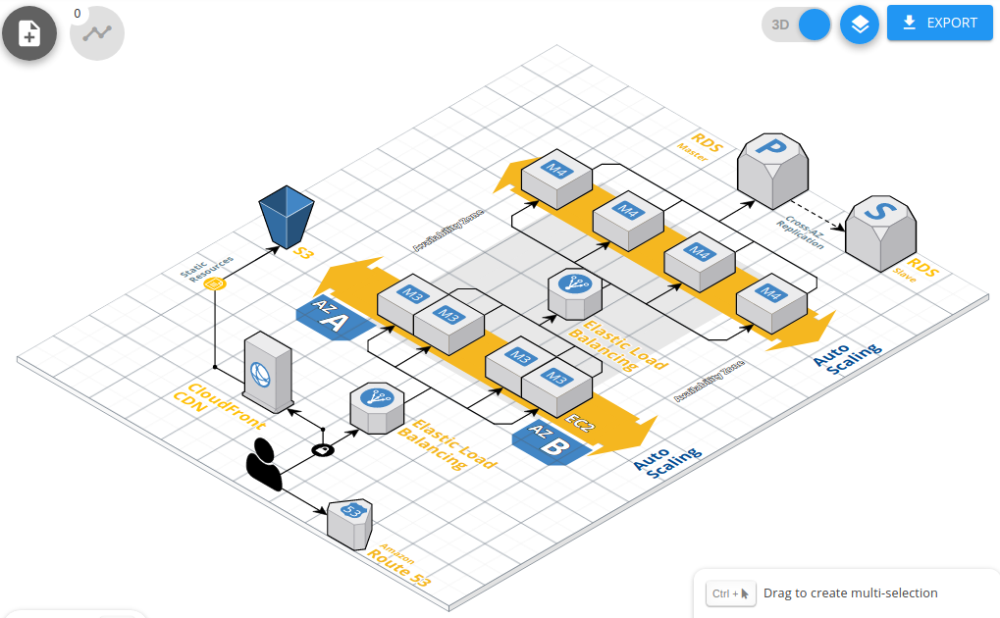
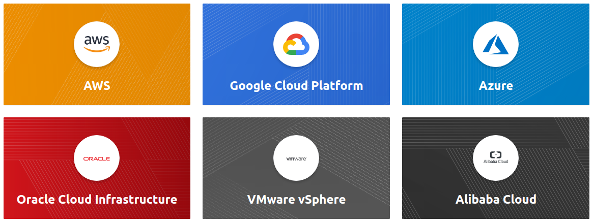
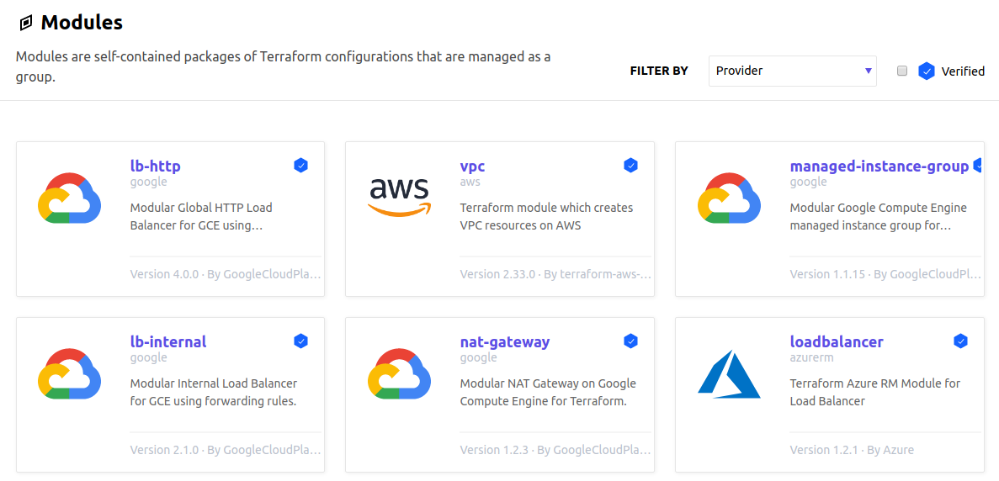

# Terraform Ecosystem

---
# Agenda
- Exam
- Tools

---
# HashiCorp Suite

### Find the odd one


---
# HashiCorp Suite

- Vagrant is written in Ruby, uses extremely feature rich DSL
- All others are written in Go, uses HCL
- HCL is not a format for serializing data structures(like JSON, YAML, etc). HCL is a syntax and API for building structured configuration formats
- HCL attempts to strike a compromise between generic serialization formats such as YAML and configuration formats built around full programming languages such as Ruby

----
# DSL pitfalls

Brian Kernighan:
«C is a razor sharp tool, with which one can create an elegant and efficient program or a bloody mess»

 
---
# HashiCorp Associate Certification

- HashiCorp sample questions
- My questions

[Quiz](https://forms.office.com/Pages/ResponsePage.aspx?id=0HIbtJ9OJkyKaflJ82fJHY204NzVx19NojnjndoVf5BUNFAwSE5MTU5HQ0JQUTMyTjRZWk4zVkM3Mi4u)

---
# go

- Knowledge of the Go language is not required, but it’s better to able for reading provider code.
- Provider code is a very subtle layer for cloud or service API.
- Providers themselves are executable files that communicate with TF via gRPC.
- Each Resource implements CREATE, READ, UPDATE, and DELETE (CRUD) methods to manage itself, while Terraform Core manages a Resource Graph of all the resources declared in the configuration as well as their current state.

---
# Installation: tfenv

```
$ git clone --depth=1 'https://github.com/tfutils/tfenv.git' ~/.tfenv
$ export PATH="$HOME/.tfenv/bin:$PATH"
$ tfenv install 0.7.0
$ tfenv use 0.7.0
$ terraform version
Terraform v0.7.0

Your version of Terraform is out of date! The latest version
is 0.12.24. You can update by downloading from www.terraform.io
```

---
# Comparison: Stack Exchange
| Tool                            | Result | Tag  |
|---------------------------------|--------|------|
| Terraform                       | 14,733 | 4971 |
| CloudFormation                  | 9,547  | 4557 |
| Azure Resource Templates        | 1801   | 1806 |
| Google Cloud Deployment Manager | 250    | 174  |

---
# Comparison: Stack Exchange
| Tool             | Jobs |
|------------------|------|
| Terraform        | 64   |
| Ansible          | 53   |
| CloudFormation   | 19   |
| Puppet           | 17   |
| SaltStack        | 4    |

---
# Contributors



---
# Version: 0.11

- November 16, 2017 → May 16, 2019
- https://github.com/hashicorp/terraform/blob/v0.11/CHANGELOG.md 
- New GCP and Azure providers require 0.12+
- Most AWS registry modules require 0.12+

---
# Version 0.12

- May 22, 2019 → March 19, 2020
- https://github.com/hashicorp/terraform/blob/v0.12/CHANGELOG.md
- Current version

---
# Version: 0.13

- Terraform now supports a decentralized namespace for providers, allowing for automatic installation of community providers from third-party namespaces 
- Ansible Collection from 2.9 and Fully Qualified Collection Namespace like community.grafana.grafana_datasource

```
terraform {
  required_providers {
    my-aws = {
      source  = "company.example/hashicorp/my-aws"
      version = "2.0.0"
    }
  }
}
```

---
# Version: 0.13

- More secure (*)
- Backward compatibility

---
# golangci-lint

```bash
$ git clone --depth=1 https://github.com/hashicorp/terraform.git
$ cd terraform
$ git checkout v0.12.24
$ golangci-lint run | grep \.go: | awk -F \( '{gsub("\)","",$NF); print $NF}'\
| sort | uniq -c | sort -n
      2 govet
     15 ineffassign
     15 structcheck
     19 staticcheck
     22 deadcode
     35 gosimple
     39 varcheck
     42 unused
     50 errcheck
```
 😱

---
# Terragrunt

- Keep your Terraform code DRY(remote source)
- Keep your remote state configuration DRY(support expressions, variables and functions)
- Keep your CLI flags DRY(extra CLI arguments)
- Execute Terraform commands on multiple modules at once(run terragrunt once)
- Work with multiple AWS accounts(assume an IAM role)
- Inputs(inputs block)
- Locals
- Before and After Hooks(actions that will be called either before or after execution)
- ...

---
# bash-completion

```bash
$ bash_it enable completion terraform
```
```bash
$ wget "https://raw.githubusercontent.com/Bash-it/bash-it/\
master/completion/available/terraform.completion.bash"
$ source terraform.completion.bash
```

---
# terraform console

```bash
$ cat main.tf 
locals {
  test = "test"
}
$ terraform console
> local.test
test
```

---
# TFLint

tflint/rules/terraformrules/terraform_required_version.go:
```go
// Check checks whether variables have descriptions
func (r *TerraformRequiredVersionRule) Check(runner *tflint.Runner) error {
	log.Printf("[TRACE] Check `%s` rule for `%s` runner", r.Name(), runner.TFConfigPath())

	module := runner.TFConfig.Module
	versionConstraints := module.CoreVersionConstraints
	if len(versionConstraints) == 0 {
		runner.EmitIssue(
			r,
			fmt.Sprintf("terraform \"required_version\" attribute is required"),
			hcl.Range{},
		)
		return nil
	}

	return nil
}
```

---
# TFLint
```bash
$ GO111MODULE=on go get github.com/terraform-linters/tflint@master
$ tflint --version
TFLint version 0.15.5
$ git clone --depth=1 https://github.com/terraform-aws-modules/terraform-aws-vpc.git
$ cd terraform-aws-vpc/
$ tflint --deep --enable-rule=terraform_typed_variables | head -12
23 issue(s) found:

Warning: `create_vpc` variable has no type (terraform_typed_variables)

  on variables.tf line 1:
   1: variable "create_vpc" {

Reference: https://github.com/terraform-linters/tflint/blob/v0.15.5/docs/rules/terraform_...
```

---
# IDEA: HashiCorp Terraform / HCL language support

09.10.2019


---
# Visual Studio Code: 4ops.terraform

31.12.2019
Too simple


---
# terraform-lsp

Supported Editors: Visual Studio Code, Atom, Vim, Sublime Text 3, IntelliJ, Emacs

```bash
$ terraform-lsp -version
v0.0.11-beta1, commit: 26e8a12ecfb9d2739ebc973e0b25888a30d0ee19, ...
```

---
# tfschema

```bash

tfschema resource show aws_lambda_function 
+--------------------------------+--------------+----------+----------+----------+-----------+
| ATTRIBUTE                      | TYPE         | REQUIRED | OPTIONAL | COMPUTED | SENSITIVE |
+--------------------------------+--------------+----------+----------+----------+-----------+
| arn                            | string       | false    | false    | true     | false     |
| description                    | string       | false    | true     | false    | false     |
| filename                       | string       | false    | true     | false    | false     |
```

---
# Visual Studio Code: mauve.terraform

25.08.2019


---
# Visual Studio Code: mauve.terraform

```json
    "terraform.indexing": {
        "enabled": false,
        "liveIndexing": false
    },
    "terraform.languageServer": {
        "enabled": true,
        "args": []
    },
```

---
# Testing: spectrum

Increasing complexity:

- terraform validate (ansible-playbook --syntax-check)
- TFLint (ansible-lint)
- awspec(integration) (molecule verify) or kitchen-terraform + kitchen-verifier-awspec(molecule test)
- terraform plan(against prod) (ansible-playbook --check)
- terraform apply (against prod)

---
# Testing: awspec

```bash
$ cat Gemfile
source 'https://rubygems.org'
gem 'awspec'
$ bundle install 
$ awspec init
$ cat spec/ec2_spec.rb
require 'spec_helper'

describe ec2('i-0f74ebda72dc44f5c') do
    it { should exist }
end
```
[Resource Types](https://github.com/k1LoW/awspec/blob/master/doc/resource_types.md)

---
# Testing: awspec

```bash
rake spec
...

ec2 'i-0f74ebda72dc44f5c'
  is expected to exist

Finished in 0.9023 seconds (files took 4.8 seconds to load)
1 example, 0 failures
```

---
# Testing

- kitchen-terraform + kitchen-verifier-awspec(automation)
- InSpec(support AWS/GCP/Azure resources)
- goss(more suitable for configuration management) - [aelsabbahy/goss: Quick and Easy server testing/validation](https://github.com/aelsabbahy/goss#goss-in-45-seconds) Quick and Easy server testing/validation [https://goss.rocks](https://goss.rocks)
- Serverspec(more suitable for configuration management)
- Testinfra(more suitable for configuration management)
- Terratest(testify for infrastructure)

---
# Test your Infrastructure with DevTestOps

[TCH NOW - Test your infrastructure! | Pawel Piwosz, EPAM Systems ](https://content.sonatype.com/2020addo/addo2020-cicd-piwosz)

---
# Lessons learned from testing Over 200,000 lines of Infrastructure Code | Lev Goncharov

[Lessons learned from testing Over 200,000 lines of Infrastructure Code | Lev Goncharov](http://www.goncharov.xyz/it/200k_iac.html)

---
# Terraformer

A CLI tool that generates tf/json and tfstate files based on existing infrastructure (reverse Terraform)

```
$ terraformer import aws --resources=vpc,subnet
2020/05/02 20:56:49 aws importing default region
2020/05/02 20:56:49 aws importing... vpc
2020/05/02 20:56:56 Refreshing state... aws_vpc.tfer--vpc-002D-505d8d3b
2020/05/02 20:57:05 aws importing... subnet
2020/05/02 20:57:12 Refreshing state... aws_subnet.tfer--subnet-002D-d1bc47ba
2020/05/02 20:57:12 Refreshing state... aws_subnet.tfer--subnet-002D-0e487974
2020/05/02 20:57:12 Refreshing state... aws_subnet.tfer--subnet-002D-46a0390a
2020/05/02 20:57:19 aws Connecting.... 
2020/05/02 20:57:19 aws save vpc
2020/05/02 20:57:19 aws save tfstate for vpc
2020/05/02 20:57:19 aws save subnet
2020/05/02 20:57:19 aws save tfstate for subnet
```

---
# Terraformer

```
$ cat generated/aws/subnet/variables.tf 
data "terraform_remote_state" "vpc" {
  backend = "local"

  config = {
    path = "../../../generated/aws/vpc/terraform.tfstate"
  }
}
$ cat generated/aws/subnet/subnet.tf 
resource "aws_subnet" "tfer--subnet-002D-0e487974" {
  assign_ipv6_address_on_creation = "false"
  cidr_block                      = "172.31.16.0/20"
  map_public_ip_on_launch         = "true"
  vpc_id                          = "${data.terraform_remote_state.vpc.outputs.aws_vpc_tfer--vpc-002D-505d8d3b_id}"
}
```

---
# Blast Radius

[28mm/blast-radius: Interactive visualizations of Terraform dependency graphs using d3.js](https://github.com/28mm/blast-radius)


_Blast Radius_ is a tool for reasoning about [Terraform](https://www.terraform.io/) dependency graphs with interactive visualizations.

Use _Blast Radius_ to:

* **Learn** about _Terraform_ or one of its providers through real [examples](https://28mm.github.io/blast-radius-docs/)
* **Document** your infrastructure
* **Reason** about relationships between resources and evaluate changes to them
* **Interact** with the diagram below (and many others) [in the docs](https://28mm.github.io/blast-radius-docs/)

[](https://github.com/28mm/blast-radius/blob/master/doc/blastradius-interactive.png)

---
# Cloudcraft: Overview


[Cloudcraft – Draw AWS diagrams](https://www.cloudcraft.co/)

Create a professional architecture diagram in minutes with the Cloudcraft visual designer, optimized for AWS with smart components.  
  
Whether you're starting a new project, or importing your existing AWS environment, Cloudcraft is the fastest and easiest way to iterate on your design.

---
# Cloudcraft: Terraform

```
terraform {
  source = "git::git@github.com:terraform-aws-modules/terraform-aws-rds.git?ref=v2.14.0"
}

include {
  path = find_in_parent_folders()
}

###########################################################
# View all available inputs for this module:
# https://registry.terraform.io/modules/terraform-aws-modules/rds/aws/2.14.0?tab=inputs
###########################################################
inputs = {
  # The allocated storage in gigabytes
  # type: string
  allocated_storage = "5"
```

---
# Registry: Providers

- Third-party providers must be manually installed


---
# Registry: Modules



---
# Registry: Requirements

- **GitHub**. The module must be on GitHub and must be a public repo
- **Named** `terraform-<PROVIDER>-<NAME>`
- **Repository** description
- **Standard** module structure. The module must adhere to the standard module structure
- **x.y.z** tags for releases

---
# Registry: Modules

```
module "vpc" {
  source  = "terraform-aws-modules/vpc/aws"
  version = "2.33.0" # optional
  # insert the 12 required variables here
}
```
---

# MultiCloud Demo

[DovnarAlexander/mutlicloud-terraform-demo-terragrunt: A Demo prepared for the Minsk DevOps community open meetup - Terragrunt](https://github.com/DovnarAlexander/mutlicloud-terraform-demo-terragrunt)


A Demo prepared for the Minsk DevOps community open meetup - Terragrunt

---
# End
