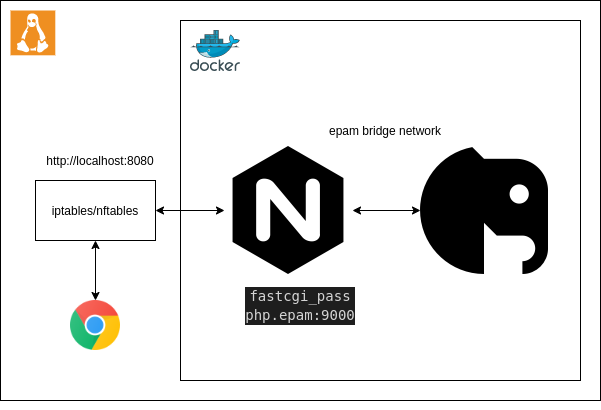
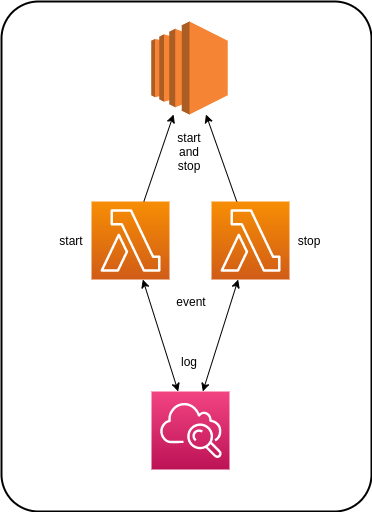

# Terraform: Homework 1

### Anatoly Burnashev

Senior System Engineer
DevOps Lead

---
# Requirements

- KISS principle(use the minimum amount of resources and arguments and no need to override default values)
- Dont's use modules and non-local backend

---
# Task 1: Docker

Deploy nginx and php containers

---
# Task 1: Docker

- Define three input variables:
  - Colon-separated name and tag for nginx container(default: "nginx:stable")
  - Colon-separated name and tag for php container(default: "php:7.4-fpm")
  - Internal network name(default: "epam")
- Define output variable:
  - URL to phpinfo()

---
# Task 1: Docker
- Define five resources:
  - nginx `docker_image`
  - php `docker_image`
  - `docker_network` for containers
  - nginx `docker_container`
  - php `docker_container`
- Copy `default.conf` inside nginx configuration directory
- Copy `index.php` inside root for PHP

---
# Task 1: Acceptance criterias

- URL in output
- phpinfo() into the URL

---
# Task 2: AWS Lambdas

Deploy lambda(s) to stop/start EC2 instances

---
# Task 2: AWS Lambdas

AWS Lambdas:
- Start and stop an EC2 instance if it has `test` tag
- Stop EC2 instances after 10 pm from Monday to Friday
- Start EC2 instances at 7 am from Monday to Friday

---
# Task 2: AWS Lambdas

- Define input variables:
  - memory size
  - timeout
  - runtime
  - schedule expressions
- Use `archive_file` data source
- Terraform configuration should update lambdas when source code is changed

---
# Task 2: AWS Lambdas

- Define two functions: for start and stop
- Define resources:
  - IAM role and managed policy
  - CloudWatch even rules and targets
  - Permissions for lambdas

---
# Task 2: Acceptance criterias

- Modify input variables to stop in the middle of the hour
- Modify input variables to start at the beginning of the hour
- Create a test instance with `test` tag
- Add your CloudWatch logs into `README.md`

---
# Links

[example](https://github.com/wrcomb/wrcomb/tree/master/school_terraform_homework)

---
# End
