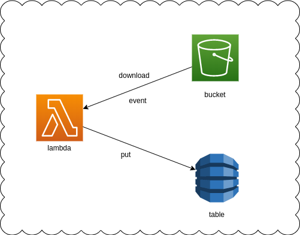

# Terraform: Homework 2

---
# Requirements

- Don't create resources in root modules
- Use remote backend

---
# Task 3: AWS Lambda

Rewrite Task 2 to using module structure and remote backend

---
# Task 4: AWS Lambda S3

Create a module that creates a S3 bucket

---
# Task 5: AWS Lambda DynamoDB

Create a module that creates a DynamoDB tables with one(partition) key `file_name`

---
# Task 6: AWS Lambda

Logs S3 objects

---
# Task 6: AWS Lambda

|file_name|md5sum                           |
|---------|---------------------------------|
|test.md  |84ddcc70bad2e36108151c95c86ff606 |

---
# Task 6: AWS Lambdas

Create a lambda that download and log file name and md5 sum created files in S3 bucket into our DynamoDB database

---
# End
